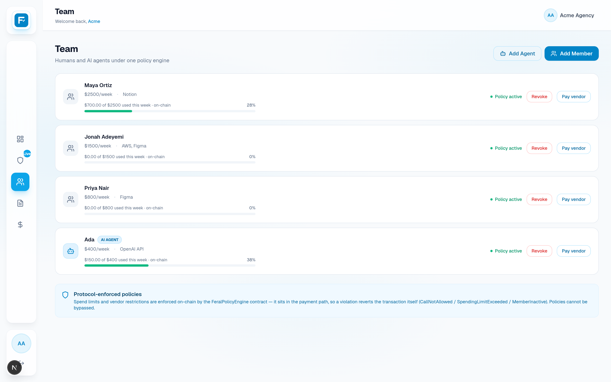
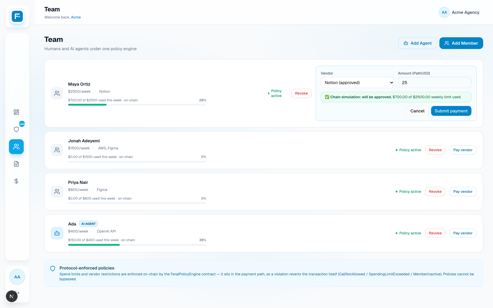
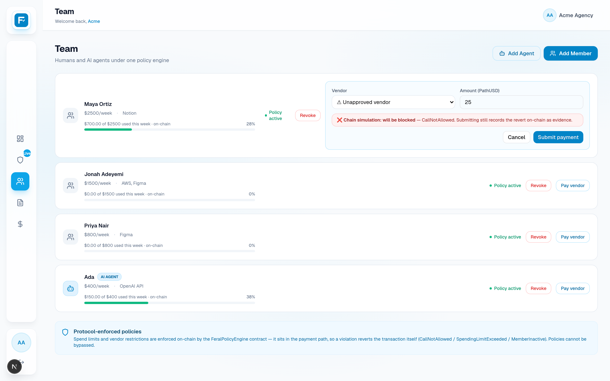
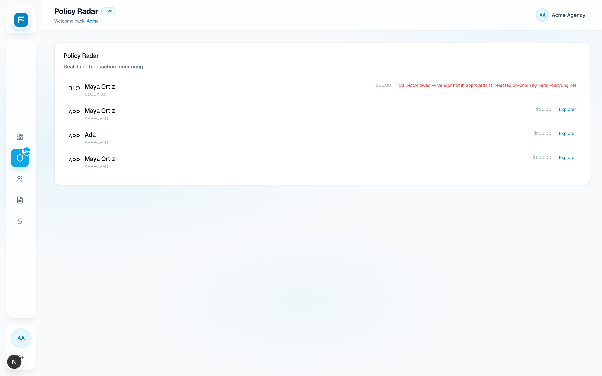
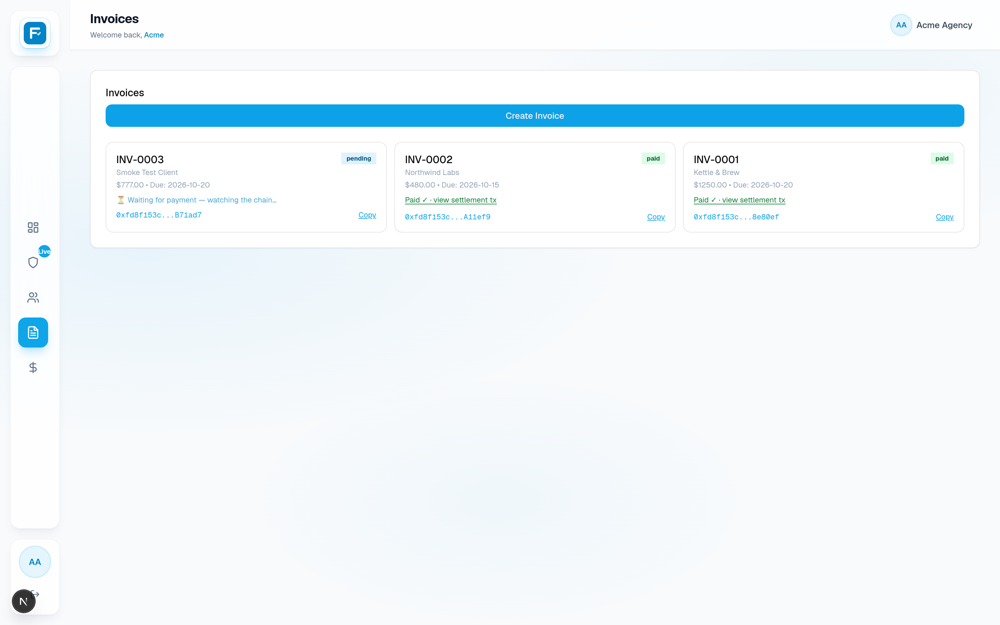

# FERAL — a programmable financial OS on Tempo

**Crypto World's Fair (Colosseum) · Tempo Track · Moderato testnet — chain id 42431**

> **Money that can say no.**
> Spend controls, self-reconciling invoices, and batch payroll — where the rules
> aren't hopes in a policy handbook, they're **transactions the chain refuses to settle**.

---

## TL;DR

FERAL gives a business a treasury, a team (humans *and* AI agents), and a set of
on-chain money rules. The rules are enforced **in the payment path** by a deployed
contract (`FeralPolicyEngine`), so:

- a payment to an **unapproved vendor reverts on-chain** — and the reverted
  transaction itself is the public, timestamped evidence of the denial;
- a member who blows their **weekly limit** is stopped by the chain, not by app logic;
- the owner can **kill a human or an agent with one transaction** — their very next
  payment reverts `MemberInactive()`;
- invoices reconcile **by themselves** via TIP-1022 virtual addresses;
- payroll is **one signature, one atomic batch** inside its validity window.

Everything below runs live on Moderato today: 3 contracts deployed, 18/18 forge
tests, 12/12 browser e2e, 8/8 kill-switch e2e — all against the real chain.

---

## Screenshots

Regenerate any time: `cd dashboard && node scripts/screenshots.mjs`
(1600×1000 @2x, captured from the running app).

| Screen | What it proves |
|---|---|
| [01-landing-hero](docs/screenshots/01-landing-hero.png) | the thesis: *"Every dollar your business moves is a policy decision."* |
| [02-landing-how-it-works](docs/screenshots/02-landing-how-it-works.png) | three primitives, honest copy |
| [03-landing-demo-beats](docs/screenshots/03-landing-demo-beats.png) | the demo script, embedded |
| [04-treasury-overview](docs/screenshots/04-treasury-overview.png) | live PathUSD balance read from the chain |
| [05-team-roster](docs/screenshots/05-team-roster.png) | roster + **weekly-spend bars straight from `spentThisWeek()`** |
| [06-preflight-approved](docs/screenshots/06-preflight-approved.png) | pre-flight `check()` — the chain says *will be approved* |
| [07-preflight-blocked](docs/screenshots/07-preflight-blocked.png) | pre-flight `check()` — the chain says *will be blocked*, before broadcast |
| [08-revoke-confirm](docs/screenshots/08-revoke-confirm.png) | type-to-confirm kill-switch dialog |
| [09-policy-radar](docs/screenshots/09-policy-radar.png) | live APPROVED / BLOCKED verdicts over WebSocket |
| [10-invoices](docs/screenshots/10-invoices.png) | one invoice waiting (watched live), two self-reconciled |
| [11-payroll](docs/screenshots/11-payroll.png) | batch payroll scheduler |












---

## 1. The problem

Businesses run on spend policies that live *outside* the money: a wiki page, a
spreadsheet, an admin panel with an "approve" button. When the app is down, the
admin is compromised, or an AI agent goes rogue, the policy disappears with it.
And when a payment *is* denied, there's usually just an error toast — no proof,
no timestamp, nothing an auditor can hold.

The same is true for reconciliation: invoices get paid into a commingled wallet
and a human matches amounts to clients, hours or days later.

**FERAL's thesis:** the policy and the evidence belong *in the transaction*.

## 2. What FERAL is

A programmable financial OS for a business, in four surfaces:

| Surface | What it does |
|---|---|
| **Team & policies** | Add humans and AI agents; each gets a wallet, a weekly limit, and an approved-vendor list — stored **on-chain** in `FeralPolicyEngine`, kept in sync by the backend, enforced by the chain at payment time. |
| **Pay vendor** | A payment executed *through* the engine. The chain decides: settle it, or revert it. Pre-flight `check()` shows the verdict **before** you send; submitting anyway is deliberate — the revert becomes evidence. |
| **Invoices** | Each invoice mints a unique TIP-1022 virtual address. A client pays it; the protocol forwards funds to the treasury in the same operation and the invoice marks itself paid. No sweep, no matching job. |
| **Payroll** | One signature over a batched Tempo transaction with `validAfter`/`validBefore`. All recipients settle atomically inside the validity window — or nothing does. |
| **Policy Radar** | Every verdict (APPROVED / BLOCKED / INVOICE_PAID / PAYROLL_EXECUTED) streams live over WebSocket, each carrying its tx hash or its **reverted tx**. |

## 3. Architecture

```
┌──────────────┐   WS events   ┌──────────────────────────────────────────────┐
│  Dashboard   │◄──────────────┤  Backend (Express)                          │
│  Next.js     │  REST + JWT   │   ├─ policy sync ──► FeralPolicyEngine       │
│  :3000       │──────────────►│   ├─ pay/check ───►   (on-chain authority)   │
└──────────────┘               │   ├─ idempotency   └─ reverts = evidence    │
                               │   ├─ TIP-1022 virtual addresses (PoW mint)   │
                               │   ├─ RPC indexer ──► invoices auto-reconcile │
                               │   └─ Supabase (read model, not the truth)    │
                               └──────────────┬───────────────────────────────┘
                                              │ viem / Tempo RPC
                                              ▼
                               Moderato testnet — chain id 42431
                               FeralRegistry · InvoiceVault · FeralPolicyEngine
                               PathUSD (TIP-20) · TIP-1022 registry · TIP-403
```

Three planes, deliberately separated:

1. **Control plane** (backend + DB) — remembers intent. It can crash; the rules
   don't disappear, because they live on-chain.
2. **Execution plane** (contracts) — the authority. `pay()` is the only place a
   policy verdict is final.
3. **Evidence plane** (explorer + Policy Radar) — every verdict has a tx hash.
   Approved → success receipt; blocked → **failed** receipt. Same weight.

---

## 4. Tempo integration (how deep, honestly)

| Tempo primitive | How FERAL uses it |
|---|---|
| **TIP-20** stablecoin (PathUSD, 6 decimals) | every payment, invoice, and payroll run |
| **TIP-1022** virtual addresses | invoice deposit addresses (`masterId \| magic \| userTag`); masterId `fd8f153c` registered on-chain via `registerVirtualMaster()` after 32-bit PoW grinding (`scripts/grind*`) |
| **TIP-403** policy registry | probed live (`0x403c…0000`): PathUSD's transfer policy is **policy #1, BLACKLIST, admin = 0x000…0** — third parties cannot bind policies to shared tokens. FERAL therefore enforces **in the payment path** with `FeralPolicyEngine`, which mirrors whitelist/blacklist semantics and is ready to be bound as the transfer policy of a business-issued token. |
| Sponsored fees | fee payer on every engine tx — demo users need no gas token |
| Sub-second finality | payments, revocations, and invoice reconciliation settle the second they're shown |
| WebSocket streaming | Policy Radar renders verdicts live as receipts land |

## 5. The core idea: enforcement in the payment path

```solidity
// FeralPolicyEngine.pay() — the whole policy engine, in effect:
require owner;                                  // NotOwner()
require policy.active;                          // MemberInactive()
require approved[vendor];                       // CallNotAllowed()
require(spentThisWeek + amount <= weeklyLimit); // SpendingLimitExceeded()
weeklySpent[week] += amount;                    // weekly window, per business+member
token.transferFrom(treasury → vendor);          // success receipt ✔
```

Design decisions worth calling out:

- **Reverts are evidence.** A blocked payment is broadcast with an explicit
  `gas: 1_500_000` so it's *included* on-chain and fails visibly. That's why a
  BLOCKED event in the Radar is a link to a real explorer page reading
  `Status: Failed`, not a claim from our backend.
- **Pre-flight before broadcast.** The pay panel debounces a read-only
  `check()` eth_call, so the user sees the chain's verdict *before* spending
  gas — then can still submit deliberately, to mint evidence.
- **Idempotency.** The client attaches a UUID per panel session; the server
  replays definitive verdicts for 15 minutes. Double-clicks cannot double-spend.
- **Chain-first failure.** If the chain can't be reached, the backend refuses
  to guess (`ChainError` → "nothing was charged"). No chain, no payment.
- **Weekly accounting on-chain.** `weeklySpent[business][member][weekIndex]` —
  every week starts at zero without any cron job.

---

## 6. Feature stories

### 6.1 Spend controls + the kill switch

Policies are created in the dashboard, written to the chain by the backend
(`syncMember`), and enforced by the engine from then on. The **Revoke** button
is type-to-confirm (you must type `REVOKE`), then:

1. `syncMember(active=false)` lands on-chain — *chain first, DB second*; if the
   chain rejects the revoke, the DB is untouched (chain = truth);
2. from that tx onward the member's `pay()` reverts `MemberInactive()`;
3. the toast shows the policy tx hash.

Robots don't get exemptions: an AI agent's wallet follows the exact same policy
object, so "agent goes rogue → one transaction → their next payment fails" is a
live demo beat, not a slide.

### 6.2 Self-reconciling invoices (TIP-1022)

Invoice created → unique virtual address minted (PoW masterId registered
on-chain) → client pays → protocol forwards to the treasury in the same
operation → indexer flips `status=paid` → `INVOICE_PAID` hits the Radar. The UI
shows *"⏳ Waiting for payment — watching the chain…"* and polls while pending,
then a **Paid ✓ · view settlement tx** link. Zero manual matching.

### 6.3 Batch payroll

A pre-signed Tempo transaction with `validAfter`/`validBefore` (execute + 1h
window). The batch either lands together or not at all — no partial payrolls.
(Honest note: in this demo the pre-signed batch is *executed* by the backend
inside its validity window; production moves signing to the browser passkey —
see §11.)

### 6.4 Policy Radar — evidence as UX

The Radar is the narrative device that makes chain verdicts legible: member,
amount, reason (`CallNotAllowed` / `SpendingLimitExceeded` / `MemberInactive`),
and the tx — success or **failure** — streamed over WebSocket the moment the
receipt lands.

## 7. Engineering highlights (the hard/interesting bits)

- **Explicit gas on expected reverts** — `eth_estimateGas` fails on a call that
  will revert; we pre-simulate to *decode the custom error name*, then broadcast
  with a fixed gas limit so the failure is recorded on-chain.
- **Custom-error decoding** — receipts don't carry revert data, so the reason is
  captured from the simulation, then rendered as human copy with chain-true
  numbers (spent/limit) in `annotateChainRevert`.
- **businessKey namespacing** — `keccak256(stringToHex(businessId))` gives every
  business an isolated 32-bit policy namespace on a shared contract.
- **Idempotency map with TTL** — definitive verdicts replay; transient chain
  errors don't poison the key.
- **Debounced pre-flight** — 400 ms debounce + cancellation guard so rapid edits
  don't race eth_calls.
- **Recipient-filtered indexer** — invoice reconciliation only reacts to
  forwards to *our* treasury; 0 errors since boot.
- **Kill-switch ordering** — chain mutation first, DB read-model second, 502 on
  chain failure.
- **Session handshake dedupe** — N hooks used to race N register calls (losers
  all got 409); now one shared in-flight promise + a session gate so no request
  ever fires with a placeholder id (no 403 flash on first paint).
- **Seed/reset tooling** — `seed_roster.ts` idempotently restores a believable
  roster and re-syncs every policy on-chain, so demo state is reproducible.

---

## 8. The demo (4 beats, all on-chain)

Storyboard: [DEMO_VIDEO.md](DEMO_VIDEO.md) (2:40). The hook: **open the explorer
on a payment our own UI refused.**

| # | Beat | Evidence |
|---|------|----------|
| 1 | Unapproved vendor → **the chain rejects it** | [`0x7ac35004…`](https://explore.testnet.tempo.xyz/tx/0x7ac35004ff33a958746932d7af553e010f166525007306500832d56814a91c52) — `Status: Failed`, `Call pay(…) on 0xDF445D3B…` |
| 2 | Rogue agent → one revoke tx → their next payment reverts `MemberInactive()` | revoke + reverted payment (kill-switch e2e reproduces this live) |
| 3 | Client pays the invoice's virtual address → protocol auto-forwards → invoice flips *paid* | [`0x5a1a9a19…`](https://explore.testnet.tempo.xyz/tx/0x5a1a9a19290132c4da1e4cf859a7f2c32988087b75f9c71171d45ece9eb4ef4a) — `Forwarded 1,250 PathUSD to 0x27A2…` |
| 4 | Approved payment settles + streams to Policy Radar | [`0x1f9b288f…`](https://explore.testnet.tempo.xyz/tx/0x1f9b288fee5fcf00afc04104e3a1249c242065a46ce22aec29f93d977735c2ec) · recent: [`0xc9b52808…`](https://explore.testnet.tempo.xyz/tx/0xc9b52808944c63da81c84af9adaab162af47719f0ff242ab79a4939b3d765688) (600 PathUSD, Maya→Notion), [`0x13954f3e…`](https://explore.testnet.tempo.xyz/tx/0x13954f3eee46bf4d35e598ef4c16bf9519b2f0bf7066e8c20a37b30fb3bab797) (150 PathUSD, Ada→OpenAI API) |

## 9. Verification matrix (run it yourself)

| Check | Command | Result |
|---|---|---|
| Contract tests | `cd contracts && forge test` | **18/18** (10 for the engine: happy path, all 3 reverts, kill switch, weekly reset, owner gating) |
| Browser e2e | `cd dashboard && node scripts/e2e.mjs` | **12/12** — no login gate, team CRUD, approved payment settles on-chain, unapproved blocked by chain, Radar receives both live |
| Kill-switch e2e | `cd dashboard && node scripts/e2e-revoke.mjs` | **8/8** — type-to-confirm modal → on-chain revoke tx → toast carries tx → row removed |
| Dashboard typecheck | `cd dashboard && npx tsc --noEmit` | **RC=0** |
| Backend typecheck | `cd backend && npx tsc --noEmit` | **RC=0** |
| Production build | `cd dashboard && npx next build` | **RC=0** (3 routes; login page removed) |
| Invoice loop | create → pay virtual address → indexer | verified on-chain twice (`INV-0001`, `INV-0002` auto-paid) |

Deployed addresses, evidence txs, and verify commands: [README.md](README.md).

---

## 10. Run it locally

```bash
cd dashboard && cp .env.example .env.local   # public testnet demo session
# terminal 1
cd backend  && npx tsx watch src/index.ts     # :3001
# terminal 2
cd dashboard && npx next dev -p 3000          # :3000
```

The dashboard opens straight onto the seeded workspace (no login gate) —
session credentials come from `.env.local`, never from source. Backend keys:
`backend/.env.example`. Reset the demo team any time with
`cd backend && npx tsx scripts/seed_roster.ts`.

## 11. Production path

What's demo-grade today and what we'd ship next — said plainly:

| Area | Now (testnet demo) | Production |
|---|---|---|
| Payment idempotency | done — client keys + 15-min server TTL, definitive verdicts replayed | durable store (Redis/Postgres) + signed requests |
| Signing | single deployer EOA in `.env` | owner multisig; per-member keys via **AccountKeychain** (calldata builder already in `accessKeyService.ts`) |
| Secrets | `.env` files | KMS-managed, per-env, no shared demo account |
| Auth | one demo session, JWT bearer | real accounts, refresh rotation, per-route rate limits |
| Source of truth | chain = truth, DB = read model (same split as prod) | + migrations, audit-log retention, replayable indexer |
| Observability | Policy Radar + explorer links | alerting on revert-rate spikes, indexer lag/health, metrics |
| Token-level policy | in-path engine (TIP-403 policy #1 is admin-locked to 0x000…0 for PathUSD) | bind `FeralPolicyEngine` as the TIP-403 transfer policy of a business-issued token |
| Payroll | pre-signed batch executed in its validity window | passkey/AccountSession signing in-browser, automated execution |
| Invoices | indexer reconciles pending → paid | webhook + pull fallbacks, SLA on reconciliation latency |

## 12. Honest limitations

- **Testnet data.** PathUSD here is a testnet TIP-20 token from the faucet.
- **TIP-403 binding is blocked for shared tokens** — we probed it on-chain and
  documented why enforcement lives in the payment path instead (README §TIP-403).
- **Payroll execution** is backend-triggered inside the validity window, not
  yet user-signed in-browser.
- **Demo session credentials are public by design** (testnet demo account,
  shipped in `.env.example`, read from env at build time).
- **One business namespace** is seeded; multi-tenant isolation exists
  (`businessKey`) but isn't load-tested.

## 13. Roadmap

1. Bind the engine as a TIP-403 policy when issuing a business token (the
   contract side is written to drop in).
2. In-browser passkey signing for payroll batches (Tempo Accounts SDK).
3. Per-vendor recurring allowances (subscription semantics) inside the engine.
4. Multi-chain Tempo deployments behind the same `businessKey` namespace.
5. Public demo instance + recorded walkthrough (see [DEMO_VIDEO.md](DEMO_VIDEO.md)).

---

**Built for the Tempo track — Crypto World's Fair by Colosseum.**
Contracts, backend, dashboard, e2e, and docs live in this repo; every claim
above is reproducible with the commands in §9.
